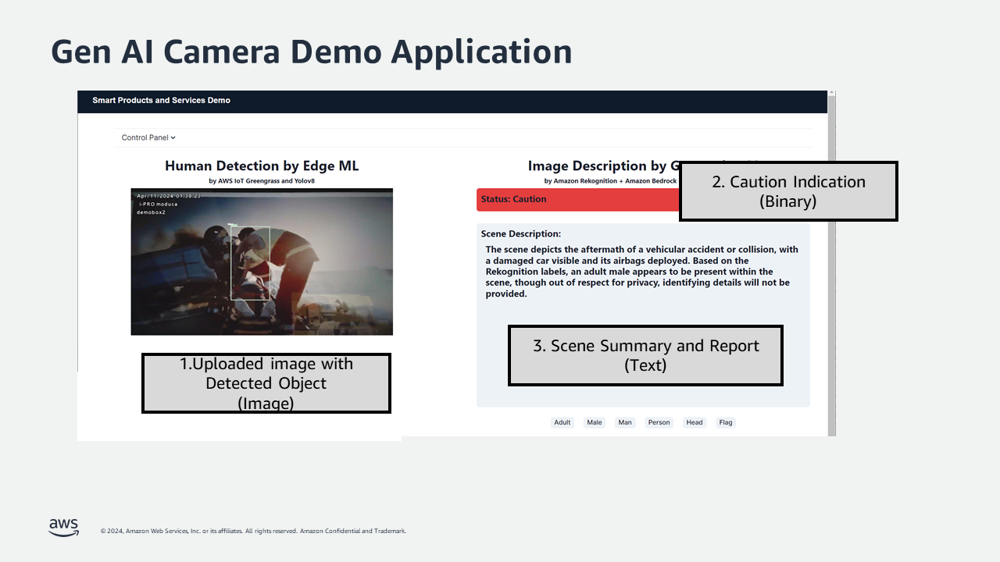
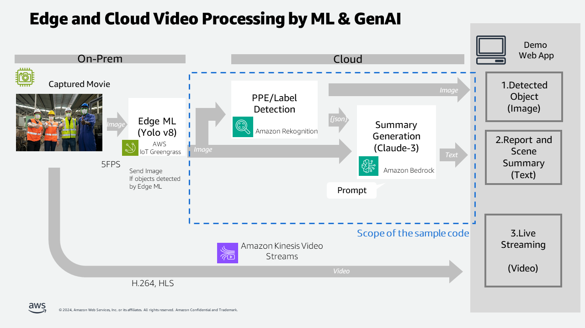
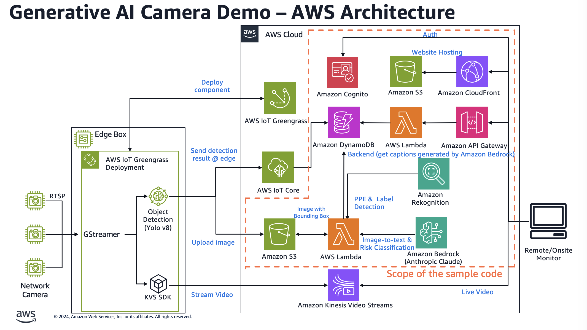

# Generative AI Camera Demo



## GenAI-Powered Image Analysis from Camera

This project is a sample code published by AWS, of a demo showcasing combination of generative AI and computer vision technology for worker safety use cases for industries like manufacturing, construction or utility. The demo was originally exhibited at the EXPO booth in AWS re:Invent 2023 and AWS booth at the Hannover Messe 2024. This demo application can analyze image frames to describe their content, determine potential hazards, and assess whether workers are wearing proper personal protective equipment (PPE). By deploying this code, you can build an application similar to the original demo.



The cloud-based web application introduced in this project allows users to upload static images to an S3 bucket. These images are then analyzed by generative AI and Amazon Rekognition, with the results displayed on the screen. This enables users to gain insights into the situation in the image, safety hazard and concerns, and PPE compliance within the manufacturing environment.




The code is described in AWS CDK which allows user to deploy the application in automated manner onto your AWS Account.

### Note
The complete code consists of edge part and  cloud part. The edge part sends the still image to S3, in which certain objects are detected by simple ML and send the entire video stream to the cloud. As the initial version of this sample, only the cloud portion is available in this repository. The edge part along with live video streaming feature will be published at a later date, following verification of automated setup processes. 


## How to deploy

### Prerequisites

- Set up CDK on your local machine and in your AWS account. For more information, see: https://docs.aws.amazon.com/cdk/v2/guide/getting_started.html
- Set up Bedrock model access in the region you use with your AWS account. In this demo, you need to have an access to Anthropic Claude 3 (Sonnet). For more information, see: https://docs.aws.amazon.com/bedrock/latest/userguide/model-access.html

### Deployment

1. Clone this repository and move to the root of this repository.
2. Run the following commands to deploy CDK Stack.

```
$ npm ci
$ npm run cdk:deploy
```
Various resources will be created, two resources below are the key items, where XXXX/YYYY/ZZZZ is the id automatically generated at the deployment time : 
- S3 bucket: mfgcamerademov2stack-edgeedgeimagesXXXX
- Cloud Front URl: https://YYYY.cloudfront.net

You can also refer to these resources in the CloudFormation stack named "MfgCameraDemoV2Stack".

3. Create prompt entry like the example prompt in 'packages/cdk/table-item-sample/prompt-templates-sample.csv' to the DynamoDB table from AWS management console. Find a DynamoDB table named like "MfgCameraDemoV2Stack-BackendPromptTemplatesZZZZ", create records with prompt name like 'accident-en' as 'id' field and the prompt text as 'prompt' field.

4. Set the default prompt id to the DynamoDB table from AWS management console. Refer to the sample data 'packages/cdk/table-item-sample/lambda-last-call-sample.csv'.  Find a DynamoDB table named like "MfgCameraDemoV2Stack-BackendLambdaLastCallZZZZ", create a record {id:prompt_id, prompt_id:accident-en}.

### Assumptions

- The sample asset will be deployed into a non-production environment for educational purposes only.
- The intended user of the code is a developer of implementing computer vision plus genAI solution, who are familiar with AWS, and can deploy the project code using CDK with minimal guidance.
- As this sample code does not include a method to put images inside the application, it is expected for the user to set up the S3 bucket with appropriate security configuration for the user and put the image to the bucket outside of the application.
- While this application allows user to select prompts from DynamoDB records, it does not provide a way to add/remove/modify the records in the DynamoDB table. The user who deploys this code needs to be allowed to update the DynamoDB by external methods such as the management console.


### How to use the web application

1. Access the web application created at the step 2 in the deployment process. You will be guided to create a user account with your e-mail address.
2. Put any jpeg image file into the S3 bucket created at the step 2 above. AS a procedure to upload image via AWS CLI, you can refer to the output of 'npm run cdk:deploy' like `GenAICameraDemoStack.BackendCfnOutputUploadImageToS3XXXXXXX`
3. The image is analyzed and described by the pipeline in 8-12 seconds with HD (1280x720) resolution image.
4. You can switch the prompt to change the behavior of the applications, by choosing "prompt" in the Control Panel. Note that changing prompt takes effect in the next timing of image analysis.


### Prompt Guidance
Behavior of the image analysis is configured by the prompt to give to the LLM.  In the example prompt two use cases are supported.

- "accident"
    - The scene in the image is described in natural language, as well as the indication if the worker in the images is in hazardous situation.
- "ppe"
    - The status of PPE (Personal Protective Equipment), such as face mask, safety vest for each person in the picture is extracted and reported in text.

You can write any prompt to support new use cases or languages by adding DynamoDB records. Prompt text is a template string of Python language to which results from Amazon Rekognition is embedded when it is executed.

#### Output Language
The output language of example prompt is English. You can specify the output language in the "\<outputLanguage\>" tag in the prompt.

### Customization

#### Integration with live video streaming
If you configured a stream from Kinesis Video Streams, you can configure the stream to generate still image periodically to S3. (See https://docs.aws.amazon.com/kinesisvideostreams/latest/dg/images.html#gs-s3Delivery). It allows you to use live video stream as the input of this application.

#### Improving latency

The Claude 3 Sonnet model that this application is configured to work with is not very fast but it generates detailed description. You can switch the type of model to Haiku to reduce the latency, also decreasing resolution of input image will also improve the latency.


